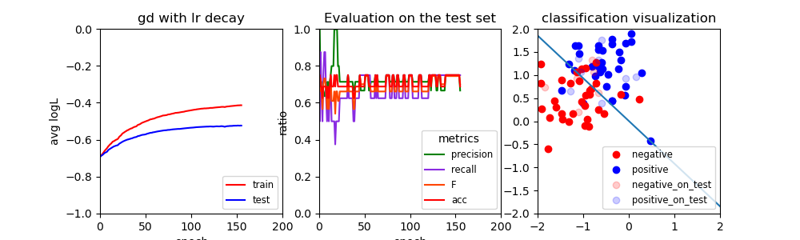
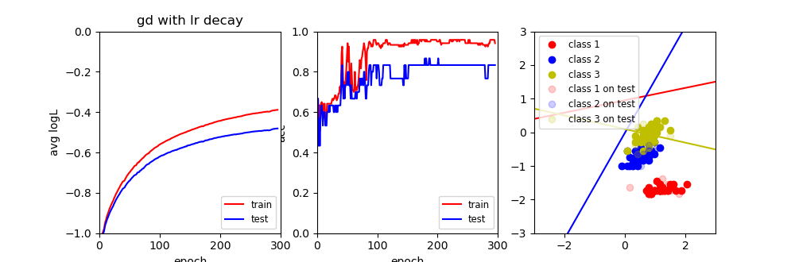
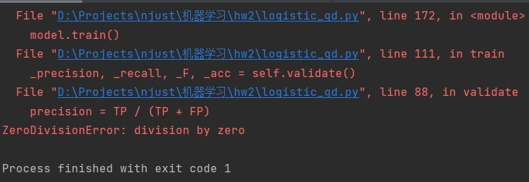

# Logistic+Softmax

#### Requirements

* python 3.7
* numpy 1.21.5
* matplotlib 3.5.2

#### Dataset

[Exam dataset](http://www.nustm.cn/member/rxia/ml/data/Exam.zip)

[Iris dataset](http://www.nustm.cn/member/rxia/ml/data/Iris.zip)

#### Files

```java
--data
    --Exam
      --test
    	  -x.txt
    	  -y.txt
      --train
          -x.txt
    	  -y.txt
    --Iris
      --test
    	  -x.txt
    	  -y.txt
      --train
          -x.txt
    	  -y.txt
--logistic_gd.py
--logistic_newton.py
--softmax.py
```

#### Start training

基于windows操作系统

##### Logistic:

GD：

```powershell
python logistic_gd.py --batch_size -1 --epoch 200
```

SGD:

```powershell
python logistic_gd.py --batch_size 16 --epoch 200
```
Newton:
```powershell
python logistic_newton.py
```

##### Softmax

GD:

​	Exam数据集:

```powershell
python softmax.py --data_path ./data/Exam --batch_size -1 --epoch 200
```

​	Iris数据集:

```powershell
python softmax.py --data_path ./data/Iris --batch_size -1 --epoch 200
```

SGD:

​	Exam数据集

```powershell
python softmax.py --data_path ./data/Exam --batch_size 16 --epoch 200
```

​	Iris数据集

```powershell
python softmax.py --data_path ./data/Iris --batch_size 16 --epoch 200
```


#### Result

(动态过程可通过运行程序获得)

logistic通过SGD在Exam数据集上的表现



softmax通过SGD在Iris数据集上的表现



#### logistic与softmax比较

##### 模型:

(1)logistic模型用于二分类而softmax用来解决多分类问题

(2)softmax输出每一类的概率值，并确定概率最大的类是预测的类，logistic只区别是与不是，当分类类别数量为2的时候softmax与logistic是等价的

##### 结果：

因为logistic只适用于二分类，所以在Exam上比较两者的结果

|          | acc(训练集)  | acc(测试集) | 收敛epoch |
| :------: | :----------: | :---------: | :-------: |
| logistic |   0.84375    |     75%     |   约100   |
| softmax  | 0.82812(avg) |     75%     |   约150   |

由模型中的(2)得知在二分类上softmax是与logistic等价的但在实验中却不完全相同。分析原因：由于softmax的参数更多，所以训练的稳定性不如logistic，虽然在调整参数的情况下acc也能达到0.84,但在多组实验的平均结果下的表现不如logistic.

补充:

由于logistic中只有一组参数，可以直接通过参数画出分类直线，可视化效果非常直观。而对于二分类问题，softmax有两组参数对应两条直线，分别预测概率在得到最终结果，所以想要得到最终的分类直线(多分类任务可能表现为分类区域)需要对得到的参数进行再处理.

#### Details

在计算分类评估指标的时候常常遇见如下错误              

原因是因为分母为0，观察公式可以知道，当分母为0的时候，分子也为0，此时我们直接置该除法表达式的值为0

#### Analysis

从结果中很容易看出logiatic和softmax在exam和iris数据上的表现较好，但却出现在测试集上的明显低于训练集上的表现

##### 产生问题的可能原因

* 数据量太少或训练集测试集划分不合理
* 出现过拟合现象

##### 解决思路

* 获取更多的数据
* 采用正则化，防止模型过拟合
