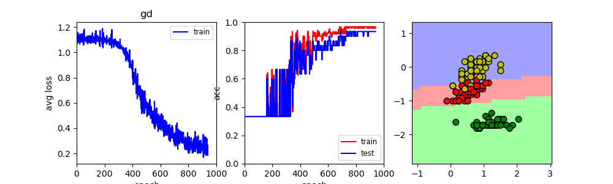
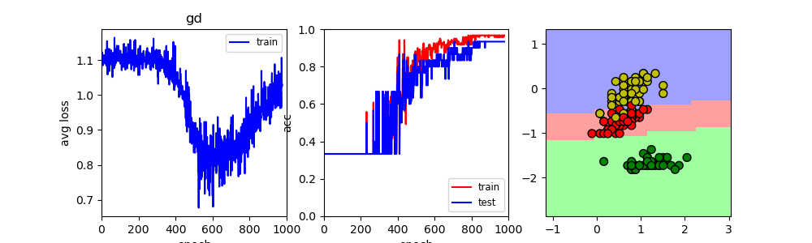

# FNN

## 1 Intro

#### 实现内容
##### 层

* Linear层

* Sigmoid层

* Softmax层

* Tanh层

* LeakyRelu层

  后四种只作为激活函数使用，不能改变输出的维度，若需改变则在其前加一个线性层.

##### 正则化项

* L2正则化
#### 简介

每一层都有前向传播和反向传播方法。

整个模型的前向传播过程就是依次执行forward函数，将上一层的输出作为下一层的输入，直到最后。模型的反向传播过程则是依次(由后先前)执行bp函数，把后一层的梯度作为输入求该层的梯度。因为作用的是分类任务，所以损失函数是交叉熵损失函数.

默认的模型结构是


这是由代码中的init_model函数中的模块与参数确定。


在遵循下列条件的情况下，您可以任意更改模型构成的层，层的类型，与层的参数来构造所需求的模型

注意

* 模型的输入一个与数据的特征数(*self.M*)相同
* 模型的输出与数据集的类别数(*self.L*)相同
* 隐藏层的输入大小应该与上一层的输出大小相同
* 由于是分类任务，为了搭配交叉熵损失函数，所以实现的代码softmax必须为最后一层
## 2. Requriments

* python 3.7
* numpy 1.21.5
* matplotlib 3.5.2
* pytorch 1.10.1
* torchvision 0.11.2
## 3. Dataset

[Exam dataset](http://www.nustm.cn/member/rxia/ml/data/Exam.zip)

[Iris dataset](http://www.nustm.cn/member/rxia/ml/data/Iris.zip)

## 4. Start training

基于windows操作系统

Exam数据集

```powershell
python Fnn_myself.py --data_path ./data/Exam --batch_size 32 --epoch 1000
```

Iris数据集

```powershell
python Fnn_myself.py --data_path ./data/Iris --batch_size 32 --epoch 1000
```


## 5. Result

在Exam上的结果


在Iris上的结果



添加正则化之后的结果


