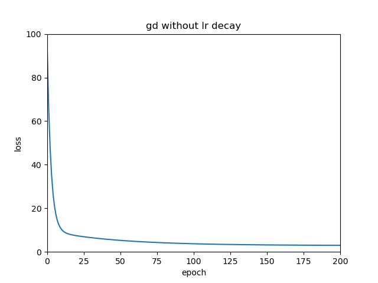
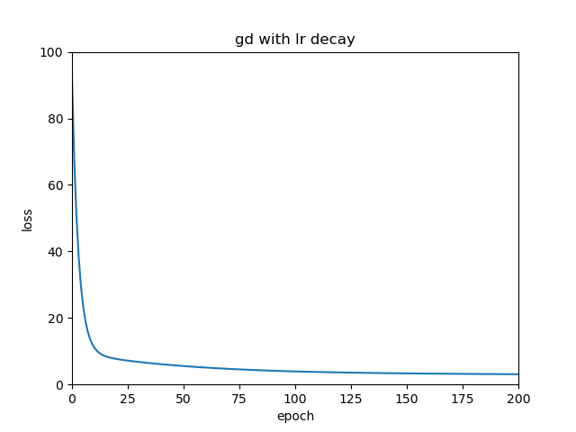
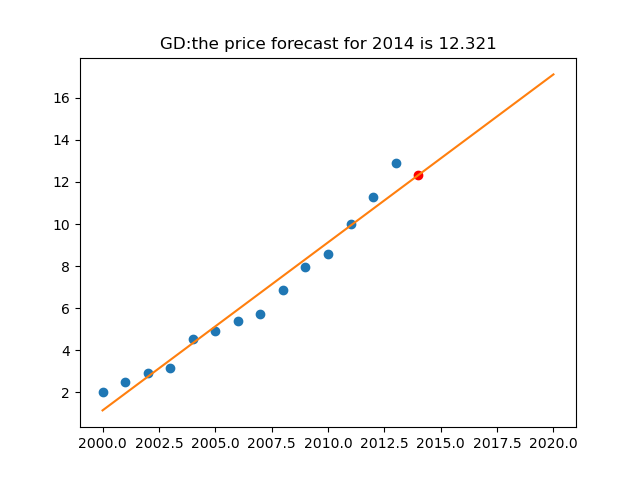

# Linear Regression 

[TOC]

## 1. 线性回归任务

线性回归:线性+回归，即通过线性模型求解回归任务.

###  1.1线性模型

  线性模型是参数对扩展自变量的线性组合，在二维平面中表示为一条直线，在高维空间中表示为一个超平面.数学表示为
$$
f~\theta~(x)=\theta _{0}+\theta _{1}x_{1}+...+\theta _{n}x_{n}\\
f:R^{n}\to R
$$
令$$ X=[x_{1},...,x_{n}]^{T} \theta=[\theta_{1},...,\theta_{n}]^{T} 则 f可表示为f=\theta_{0}+\theta^{T}X,若扩展自变量X=$$ $$[1,x_{1},...,x_{n}]^{T} 同时令\theta=[\theta_{0},\theta_{1},...,\theta_{n}]^{T}，则$$
$$
f_{\theta}(x)=\theta^{T}X
$$


### 1.2 回归任务

回归任务：找到一个$$f$$(本文中为线性模型),通过输入的特征值，可以得到一个合适的连续的数值.

评估任务的完成情况(**损失函数**):

通过已知的数据与模型的预测值可以建立损失函数:$$J(\theta)=g(f_{\theta}(x),y)$$作为评估函数的指标,该函数值越低，代表所得的函数越好.本文中采用**最小二乘(Least Mean Square, LMS**)
$$
J(\theta)=\frac{1}{2}\sum_{k=1}^{N}(f_{\theta}(x^{(k)})-y^{(k)})^2
$$
因为已经定义了模型的结果，所以为了得到最好的模型就是得到使损失函数最小的参数,即
$$
\theta^{*}=\arg\min\limits_{\theta}J(\theta)
$$

## 2. 求解

将通过解析法和梯度下降法求得使损失函数最低的参数，本实验采用解析法和梯度下降法，由于数据量较小所以不采用随机梯度下降.

### 2.1解析法

基于矩阵计算LMS梯度
$$
𝛻_{\theta}J(\theta)=𝛻_{\theta}\frac{1}{2}
(X\theta-y)^{T}(X\theta-y)=X^{T}X\theta-X^{T}y
$$
[矩阵求导性质](https://en.wikipedia.org/wiki/Matrix_calculus)

梯度置数即可得到解析解
$$
\theta^{*}=(X^{T}X)^{-1}X^{T}y
$$

### 2.2梯度下降法

由于矩阵运算时间复杂度大，并且常常不可逆，所以也常常通过梯度下降法来求得参数

主要思想:梯度反方向是函数值下降最快的方向

优化过程:

– 从初始位置开始（即初始参数$$\theta^{(0)}$$） 

– 在当前位置$$\theta^{(t)}$$，重复直到收敛

​		• 计算当前位置梯度：$$𝛻_{𝜽}𝑓(𝜽)|_{\theta=\theta^{(t)}}$$

​		• 沿梯度反方向移动到下一个位置：$$\theta^{(t+1)}\leftarrow\theta^{(t)}-𝛼*𝛻_{𝜽}𝑓(𝜽)|_{\theta=\theta^{(t)}}$$ ，𝛼是学习率

​		• 𝑡 = 𝑡 + 1

## 3. 南京房价预测

##### Requirements

* python 3.7
* numpy 1.21.5
* matplotlib 3.5.2

##### Data

[南京市房价数据](http://www.nustm.cn/member/rxia/ml/data/Price.zip)

##### Files

```java
--data
    --price
    	-x.txt
    	-y.txt
--linear_regression_analytical_solution.py
--linear_regression_gd.py
```

##### Start training

基于windows操作系统

解析法：

```powershell
python linear_regression_analytical_solution.py --predict_year 2014
```

梯度下降法

```powershell
python linear_regression_gd.py --predict_year 2014
```

##### Details

在使用解析法求解的时候发现，由于年份太大导致梯度太大，训练非常不稳定，若通过调节学习率来控制梯度下降，则需要很小的学习率，此时在loss较小的时候又会出现梯度消失导致训练法务进行。所以采用梯度下降法求解的时候，先将数据归一化
$$
x^{'}=\frac{x-x_{min}}{x_{max}-x_{min}}
$$
同时采用学习率衰减策略,每100个epoch衰减一次($decay$为超参数，本实验中默认为0.9)
$$
learning\ rate=learning\ rate *decay
$$

##### Experiments

|             方法              |   loss    | 参数值($\theta_{0},\theta_{1}$) |
| :---------------------------: | :-------: | :-----------------------------: |
|            解析法             | 2.9050289 |        (-1576.874,0.799)        |
|          梯度下降法           |    NAN    |                                 |
|      梯度下降法(归一化)       | 2.9050289 |        (1.13497,10.3870)        |
| 梯度下降法(归一化+学习率衰减) | 2.9050290 |        (1.13484,10.3872)        |

注：解析法的参数是直接作用于年份，而后两种梯度下降法是对应年份归一化之后的参数.

##### Result

解析法


梯度下降法：








