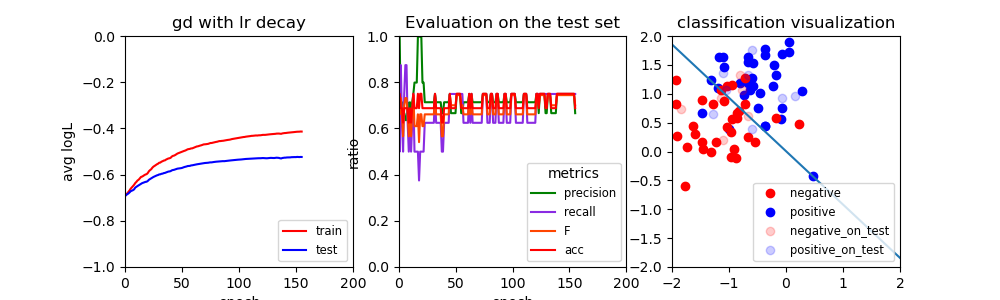
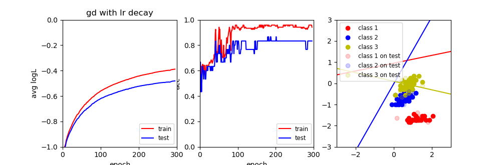

# Logistic+Softmax

[TOC]

## Logistic

### 模型假设

$$
\delta(z)=\frac{1}{1+e^{-z}} \\
p(y=1|x;\theta)=h(x)=\delta(\theta^{T}x)\\
p(y=0|x;\theta)=1-h(x)
$$

统一形式
$$
p(y|x;\theta)=h(x)^{y}*(1-h(x))^{1-y}=(\frac{1}{1+e^{-\theta^T X}})^{y}(1-\frac{1}{1+e^{--\theta^T X}})^{1-y}
$$


### 最优化目标

由于模型的假设是通过条件概率的形式表达，那么很自然最优化的目标就是最大化似然函数
$$
L(\theta)=\prod_{k=1}^{N}p(y^{(k)}|x^{(k)};\theta)\\
=\prod_{k=1}^{N}h(x^{(k)})^{y^{(k)}}*(1-h(x^{(k)}))^{1-y^(k)}\\
=\prod_{k=1}^{N}=(\frac{1}{1+e^{-\theta^T x^{(k)}}})^{y^{(k)}}(1-\frac{1}{1+e^{-\theta^T x^{(k)}}})^{1-y^{(k)}}
$$
即
$$
\theta^{*}=\arg\max\limits_{\theta}L(\theta)=\arg\max\limits_{\theta}\log(L(\theta))\\
\log(L(\theta))=\sum_{k=1}^{N}y^{(k)}\log(h(x^{(k)}))*(1-y^{(k)})\log(1-h(x^{(k)}))
$$


### 学习算法

#### 梯度下降(上升)

#### 牛顿法

### 预测

## 实验

#### Requirements

* python 3.7
* numpy 1.21.5
* matplotlib 3.5.2

#### Dataset

[Exam dataset](http://www.nustm.cn/member/rxia/ml/data/Exam.zip)

[Iris dataset](http://www.nustm.cn/member/rxia/ml/data/Iris.zip)

#### Files

```java
--data
    --Exam
      --test
    	  -x.txt
    	  -y.txt
      --train
          -x.txt
    	  -y.txt
    --Iris
      --test
    	  -x.txt
    	  -y.txt
      --train
          -x.txt
    	  -y.txt
--logistic_gd.py
--logistic_newton.py
--softmax.py
```

#### Start training

基于windows操作系统

##### Logistic:

GD：

```powershell
python logistic_gd.py --batch_size -1 --epoch 200
```

SGD:

```powershell
python logistic_gd.py --batch_size 16 --epoch 200
```
Newton:
```powershell
python logistic_newton.py
```

##### Softmax

GD:

​	Exam数据集:

```powershell
python softmax.py --data_path ./data/Exam --batch_size -1 --epoch 200
```

​	Iris数据集:

```powershell
python softmax.py --data_path ./data/Iris --batch_size -1 --epoch 200
```

SGD:

​	Exam数据集

```powershell
python softmax.py --data_path ./data/Exam --batch_size 16 --epoch 200
```

​	Iris数据集

```powershell
python softmax.py --data_path ./data/Iris --batch_size 16 --epoch 200
```


#### Result

logistic通过SGD在Exam数据集上的表现



softmax通过SGD在Iris数据集上的表现



#### Analysis

从结果中很容易看出logiatic和softmax在exam和iris数据上的表现较好，但却出现在测试集上的明显低于训练集上的表现

##### 产生问题的可能原因

* 数据量太少或训练集测试集划分不合理
* 出现过拟合现象

##### 解决思路

* 获取更多的数据
* 采用正则化，防止模型过拟合
